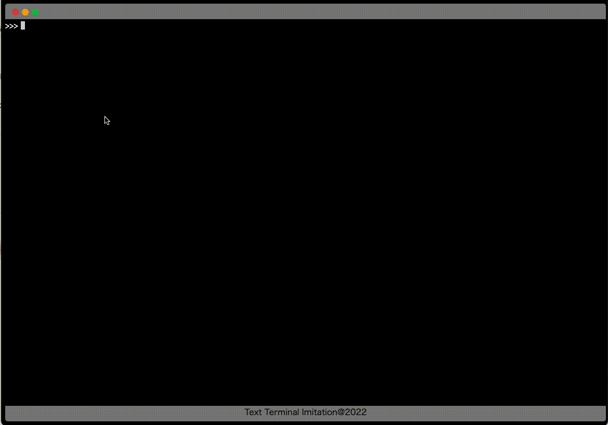

# react-text-terminal-imitation

テキストターミナル風 UI



## SetUp

```
yarn install
```

## devServer

```
yarn start
```

## build

```
yarn build
```

## How to move the cursor

### Left

`ArrowLeft` or `CTRL + b`

### Right

`ArrowRight` or `CTRL + f`
